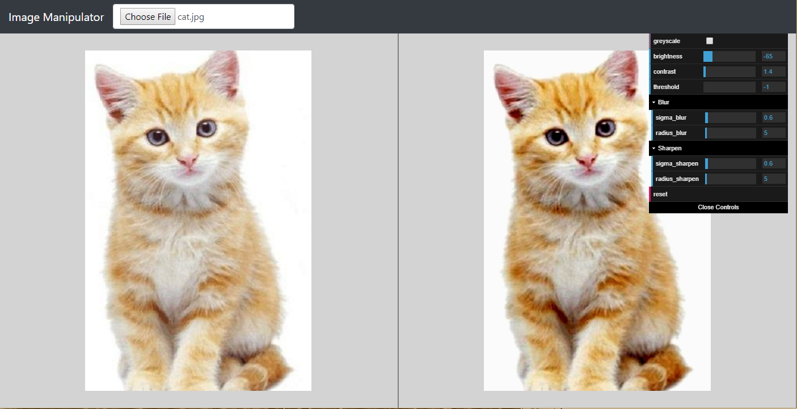
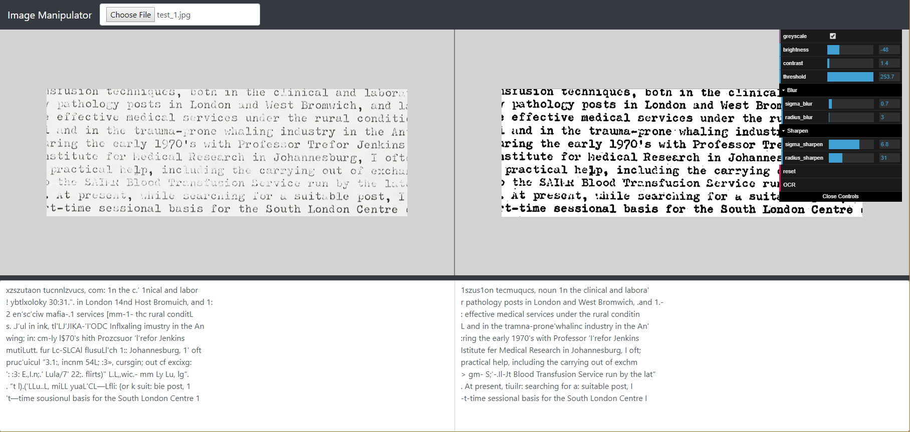

## Image Manipulator

Image manipulation tool with side-by-side comparison and real-time updates. A user can pan and zoom either image and it will be applied to both images for easy comparisons. The left image is the oringal user provided image, the right is the manipulated image.

[**Click here to run the latest version of Image Manipulator**](https://rawgit.com/SpencerWie/JavaScript/master/ImageManipulator/index.html)

### Version 0.38

### How to use:

Click on *"Choose File"* and select an image from your computer, it will be added into the left image element. Currently there are four operations that can be done using the editor:

* **Greyscale**: Checking this will greyscale the image
* **Brightness**: The user can change the brightness of the image from -100 to 100, this is the added value on the pixel data
* **Contrast**: The user can change the brightness of the image from -100 to 100, this is the mulitplied value on the pixel data
* **Blur**: The user can blur the image by sigma/raduis amount, applying a guassain blur.
* **Sharpen**: Will apply a blur and subtract that from the oringal image, creating a sharpened image.
* **OCR**: Will OCR both images and display the result as text in the bottom window.
* **Reset**: Will reset the image operations back to default along with the pan and zoom.

### OCR

Tesseract is used as an OCR for a practical use case for image manipulation, which can improve text extraction. To do this click the *"OCR"* button and open the bottom window (*mouse mouse to the bar on the bottom and click and drag it up*), the textarea will turn grey to signify it's being processed on when complete will turn back to white with the results.

Below is an example where deceases brightness mixed with increases contrast, along with a slight blur and a applied sharpening. Then a high image thresolding to make nearly any  to further force the image text to black, shows improved text extraction results:

### Using Installed OS Tesseract

You can now use the Tesseract installed on your own machine to OCR images, this provides the benifit of using an updated and significantly faster and more accurate version of Tesseract instead of Tesseract.JS. First install [Node.JS](https://nodejs.org/en/) on your machine, then run:

    node server.js
    
This will startup a localhost server of the ImageManipulator, now go to the following URL in a web broswer:

    http://127.0.0.1:3000/

*Notes:* This assumes you have Tesseract [downloaded](https://github.com/tesseract-ocr/tesseract/wiki/Downloads) or directly [compiled](https://github.com/tesseract-ocr/tesseract/wiki/Compiling) on your machine and configured to be able to use via the command line call `tesseract ..`. If not install Tesseract and ensure the envoirnment variable `Path` is set to the location of `tesseract.exe`.

### Libraries Used:

* [opencv.js](https://docs.opencv.org/3.3.1/df/d0a/tutorial_js_intro.html) - Libary used for image manipulations.
* [dat.GUI](https://github.com/dataarts/dat.gui) - The GUI interface libary for image manipulation parameters.
* [jQuery](https://jquery.com/) / [jQuery PanZoom](https://github.com/timmywil/jquery.panzoom) - Libary used for help with pan and zoom operations
* [Tesseract.js](https://github.com/naptha/tesseract.js) - Used for image OCR into text.
* [Bootstrap 4](https://getbootstrap.com/) - Used for consitence page styling and look across broswers (*Modifed to fix visual issue it creates on dat.GUI*)
* [Node.JS](https://nodejs.org/en/) (_Optional Dependency_)

---

### Whats coming in Version 0.4:

* ~Node.JS Local Server to allow Tesseract or any OCR to be ran via system command line to drastically improve performance and accuracy.~ _- Done_
* Interface for Tessseract OCR parameters. _- In Process_ 
* ~Improved Memory useage of Tesseract.js to allow to OCR large images.~ _- Done_
* *"Real-time"* checkbox with update button to improve manipulation performance on large images. _- Not Started_
